# BlueOlive Backend Improvement Plan

Based on the assessment feedback, this plan addresses three areas for improvement:

## Executive Summary

| Area | Current State | Target State | Impact |
|------|---------------|--------------|--------|
| **API Documentation** | drf-spectacular installed but may not be visible/accessible | Fully accessible OpenAPI/Swagger + Redoc UI | +0.5 rating |
| **CI/CD Pipeline** | No GitHub Actions workflows | Automated CI pipeline with testing, linting, security scans | +0.5 rating |
| **Error Handling** | Distributed try/except blocks (264 instances) | Centralized exception handling with standardized responses | +0.5 rating |

---

## TODO-1: API Documentation (OpenAPI/Swagger)

### Current Analysis
- **drf-spectacular** is already installed (`drf-spectacular==0.27.0` in requirements.txt)
- Endpoints configured in [`core/urls.py`](backend/core/core/urls.py:85-86):
  - `/api/schema/` - OpenAPI schema (YAML/JSON)
  - `/api/docs/` - Swagger UI
- Configuration exists in [`core/settings.py`](backend/core/core/settings.py:492-499) but uses basic settings
- **Issue**: `SERP_PERMISSIONS` may require authentication, making docs inaccessible

### Implementation Steps

1. **Review current drf-spectacular configuration**
   - Check if authentication is blocking access to `/api/docs/`
   - Verify schema generation includes all endpoints

2. **Enhance SPECTACULAR_SETTINGS** ([`core/settings.py`](backend/core/core/settings.py:492-499))
   ```python
   SPECTACULAR_SETTINGS = {
       'TITLE': 'BlueOlive API',
       'DESCRIPTION': 'Enterprise Multi-Tenant POS Management System API',
       'VERSION': '1.0.0',
       'SERVE_PERMISSIONS': ['rest_framework.permissions.AllowAny'],  # Allow public access
       'SCHEMA_PATH_PREFIX': '/api/',
       'TAGS': [
           {'name': 'Authentication', 'description': 'User login, logout, token refresh'},
           {'name': 'Tenants', 'description': 'Multi-tenant management'},
           {'name': 'POS', 'description': 'Point of Sale operations'},
           {'name': 'Stock Control', 'description': 'Inventory management'},
           {'name': 'Debtors', 'description': 'Customer accounts receivable'},
           {'name': 'Creditors', 'description': 'Supplier accounts payable'},
           {'name': 'Cash Book', 'description': 'Cash transactions'},
           {'name': 'General Ledger', 'description': 'Financial accounting'},
           {'name': 'Purchase Orders', 'description': 'PO management'},
           {'name': 'Settings', 'description': 'System configuration'},
       ],
       'ENUM_NAME_OVERRIDES': {
           # Custom enum definitions for choices
       },
       'COMPONENT_SPLIT_REQUEST': True,  # Separate request/response schemas
   }
   ```

3. **Add Redoc as alternative documentation**
   - Install: Already available in drf-spectacular
   - Add endpoint: `/api/redoc/` → RedocUIView
   - Benefits: Better for non-technical stakeholders

4. **Add API metadata endpoint**
   - Enhance `/api/` root endpoint with API version info
   - Include links to documentation

### Expected Outcome
- `/api/docs/` accessible without authentication
- `/api/redoc/` available as alternative
- `/api/schema/` provides complete OpenAPI 3.0 schema
- All endpoints properly tagged and documented

---

## TODO-2: CI/CD Pipeline (GitHub Actions)

### Current Analysis
- No `.github/workflows` directory exists
- Tests exist but no automation
- pytest is installed but no configuration file
- Requirements include both production and dev dependencies

### Implementation Steps

1. **Create workflow directory structure**
   ```
   .github/
   └── workflows/
       ├── ci.yml          # Main CI pipeline
       └── docker.yml     # Docker build/push (optional)
   ```

2. **Create main CI workflow** (`.github/workflows/ci.yml`)

   ```yaml
   name: CI Pipeline
   
   on:
     push:
       branches: [main, develop]
     pull_request:
       branches: [main, develop]
   
   jobs:
     test:
       runs-on: ubuntu-latest
       
       services:
         postgres:
           image: postgres:15
           env:
             POSTGRES_PASSWORD: postgres
           options: >-
             --health-cmd pg_isready
             --health-interval 10s
             --health-timeout 5s
             --health-retries 5
           ports:
             - 5432:5432
       
       steps:
         - uses: actions/checkout@v4
         
         - name: Set up Python
           uses: actions/setup-python@v5
           with:
             python-version: '3.12'
             cache: 'pip'
         
         - name: Install dependencies
           run: |
             cd backend/core
             pip install -r requirements.txt
             pip install pytest pytest-cov flake8 bandit
         
         - name: Run linters
           run: |
             flake8 . --max-line-length=120 --ignore=E501
             bandit -r . -x ./migrations
         
         - name: Run tests
           env:
             DB_NAME: test_blueolive
             DB_USER: postgres
             DB_PASSWORD: postgres
             DB_HOST: localhost
           run: |
             pytest --cov=. --cov-report=xml
   ```

3. **Add pytest configuration** (`pytest.ini` or `pyproject.toml`)
   ```ini
   [tool.pytest.ini_options]
   DJANGO_SETTINGS_MODULE = core.settings
   python_files = tests.py test_*.py *_tests.py
   python_classes = Test*
   python_functions = test_*
   addopts = --strict-markers --tb=short
   testpaths = apps tenancy shop_users
   ```

4. **Add coverage configuration**
   - Use coverage.py with `codecov` action
   - Generate XML report for CI integration

5. **Optional: Docker workflow**
   - Build Docker image on tag/push to main
   - Run security scans (trivy)
   - Push to registry

### Expected Outcome
- Automated testing on every PR
- Linting catches code style issues
- Security scans identify vulnerabilities
- Coverage reports available in PR

---

## TODO-3: Centralized Error Handling

### Current Analysis
- **264 instances** of try/except blocks found
- Each handler returns errors differently
- No standardized error response format
- Basic circuit breaker exists in [`core/resilience.py`](backend/core/core/resilience.py:1)

### Implementation Steps

1. **Create custom exception classes** (`core/exceptions.py`)
   ```python
   class BlueOliveException(Exception):
       """Base exception for all BlueOlive errors"""
       code = 'BLUEOLIVE_ERROR'
       status_code = 500
       message = 'An internal error occurred'
   
   class ValidationError(BlueOliveException):
       code = 'VALIDATION_ERROR'
       status_code = 400
   
   class AuthenticationError(BlueOliveException):
       code = 'AUTHENTICATION_ERROR'
       status_code = 401
   
   class PermissionError(BlueOliveException):
       code = 'PERMISSION_ERROR'
       status_code = 403
   
   class NotFoundError(BlueOliveException):
       code = 'NOT_FOUND'
       status_code = 404
   
   class BusinessRuleError(BlueOliveException):
       code = 'BUSINESS_RULE_VIOLATION'
       status_code = 422
   ```

2. **Create global exception handler** (`core/exception_handler.py`)
   ```python
   def custom_exception_handler(exc, context):
       # Standardize all error responses
       response_data = {
           'error': {
               'code': exc.code,
               'message': exc.message,
               'details': getattr(exc, 'details', None),
               'field_errors': getattr(exc, 'field_errors', None),
           }
       }
       return Response(response_data, status=exc.status_code)
   ```

3. **Update REST_FRAMEWORK settings** ([`core/settings.py`](backend/core/core/settings.py:182-211))
   ```python
   REST_FRAMEWORK = {
       ...
       'EXCEPTION_HANDLER': 'core.exception_handler.custom_exception_handler',
   }
   ```

4. **Create middleware for unhandled exceptions** (optional)
   - Catch any remaining unhandled exceptions
   - Return standardized error response
   - Log appropriately

5. **Apply to new code and optionally refactor existing**
   - Use custom exceptions in new development
   - Consider refactoring critical paths
   - Document error codes in OpenAPI

### Expected Outcome
- All API errors return consistent format
- Error codes enable client-side handling
- Field-level validation errors clearly communicated
- Easier debugging with structured logging

---

## Architecture Diagram

```mermaid
graph TB
    subgraph "Current State"
        A[Client Request] --> B[Django View]
        B --> C{try/except}
        C -->|Success| D[Response]
        C -->|Error| E[Various Error Formats]
    end
    
    subgraph "After Improvements"
        F[Client Request] --> G[Django View]
        G --> H[Custom Exceptions]
        H --> I[Exception Handler]
        I --> J[Standardized Response]
    end
    
    subgraph "CI/CD"
        K[Git Push] --> L[GitHub Actions]
        L --> M[Lint & Security]
        L --> N[Run Tests]
        M --> O[PR Feedback]
        N --> O
    end
    
    subgraph "API Docs"
        P[Developer] --> Q[/api/docs/]
        Q --> R[Swagger UI]
        Q --> S[OpenAPI Schema]
    end
```



---

## Files to Create/Modify

### New Files
| File | Purpose |
|------|---------|
| `.github/workflows/ci.yml` | Main CI pipeline |
| `pytest.ini` or `pyproject.toml` | Pytest configuration |
| `core/exceptions.py` | Custom exception classes |
| `core/exception_handler.py` | Global exception handler |

### Modified Files
| File | Changes |
|------|---------|
| `core/settings.py` | Add exception handler, enhance SPECTACULAR_SETTINGS |
| `core/urls.py` | Add Redoc endpoint |

---

## Priority Order

1. **CI/CD Pipeline** - Foundation for quality (no code changes risk)
2. **API Documentation** - Quick win, improves developer experience
3. **Error Handling** - Requires careful implementation to avoid breaking changes

---

## Risk Assessment

| Area | Risk | Mitigation |
|------|------|------------|
| API Docs | Breaking existing integrations | Keep backward compatible responses |
| CI/CD | Test failures | Start with lenient settings, tighten over time |
| Error Handling | Breaking existing error responses | Phase in gradually, keep format similar |

---

## Next Steps

1. **Approve this plan** - Confirm implementation scope
2. **Begin implementation** - Start with highest priority items
3. **Iterative review** - Test each component before moving on
