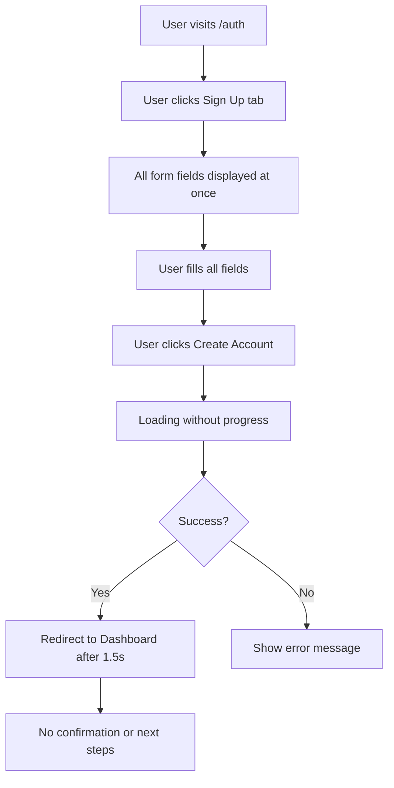
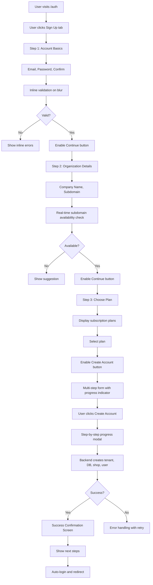

# Tenant Creation Flow - UX/UI Redesign Specification

## 1. Executive Summary

This document outlines a complete redesign of the tenant creation (signup) flow for the BlueOlive application. The goal is to create the simplest, most intuitive user experience while ensuring all API endpoints are implemented correctly and efficiently.

### Current State Analysis

| Component | Status | Issues |
|-----------|--------|--------|
| Frontend Signup Form | Implemented in `/auth/page.tsx` | Shows all fields at once, no progressive disclosure |
| Backend API | Implemented at `/api/v1/users/auth/signup/` | Works correctly |
| Loading States | Minimal | No progress indication during tenant creation |
| Inline Validation | Basic | No real-time feedback |
| Success Flow | Partial | Redirects to dashboard without confirmation steps |
| Accessibility | Partial | Missing ARIA labels and proper focus management |

---

## 2. User Journey Flow

### Current Flow (Problematic)



### Proposed Optimized Flow



---

## 3. Form Fields Specification

### Step 1: Account Basics (Minimal Required Fields)

| Field | Type | Label | Helper Text | Validation Rules |
|-------|------|-------|--------------|-----------------|
| email | email | Email Address | We'll use this for account notifications | Required, valid email format, max 150 chars |
| password | password | Password | Must be at least 8 characters with letters and numbers | Required, min 8 chars, at least 1 letter, 1 number |
| confirmPassword | password | Confirm Password | Must match password | Required, must match password |

### Step 2: Organization Details

| Field | Type | Label | Helper Text | Validation Rules |
|-------|------|-------|--------------|-----------------|
| companyName | text | Company Name | This will appear on your invoices | Required, 2-200 chars |
| subdomain | text | Subdomain | Your unique URL: subdomain.blueolive.app | Required, 3-50 chars, lowercase alphanumeric + hyphens, unique check |
| firstName | text | First Name | Your first name | Optional |
| lastName | text | Last Name | Your last name | Optional |

### Step 3: Subscription Plan

| Field | Type | Label | Helper Text | Validation Rules |
|-------|------|-------|--------------|-----------------|
| subscriptionPlan | select | Choose Your Plan | Select a plan that fits your needs | Required, must be active plan |

---

## 4. API Endpoints

### 4.1 Existing Endpoints (No Changes Needed)

#### POST `/api/v1/users/auth/signup/`

**Purpose:** Creates new tenant, database, shop, and admin user

**Request Parameters:**

```json
{
  "email": "string (required, max 150 chars)",
  "username": "string (required)",
  "password": "string (required, min 8 chars)",
  "confirm_password": "string (required)",
  "first_name": "string (optional)",
  "last_name": "string (optional)",
  "company_name": "string (required)",
  "subdomain": "string (required, unique)",
  "subscription_plan_id": "integer (required)"
}
```

**Success Response (200/201):**

```json
{
  "id": 1,
  "name": "Company Name",
  "email": "user@example.com",
  "subdomain": "company",
  "shops": [
    {
      "id": 1,
      "name": "Main Office",
      "subdomain": "main"
    }
  ],
  "message": "Account created successfully"
}
```

**Error Responses:**

| Status | Error Code | Message |
|--------|------------|---------|
| 400 | INVALID_EMAIL | Invalid email format |
| 400 | PASSWORD_TOO_SHORT | Password must be at least 8 characters |
| 400 | PASSWORDS_MISMATCH | Passwords do not match |
| 400 | SUBDOMAIN_TAKEN | Subdomain already taken |
| 400 | MISSING_FIELDS | Missing required fields |
| 500 | SERVER_ERROR | An error occurred during setup |

### 4.2 New Endpoints Required

#### GET `/api/v1/users/auth/signup/validate-subdomain/`

**Purpose:** Real-time subdomain availability check

**Request Parameters:**

```
Query Param: subdomain (string, required)
```

**Success Response (200):**

```json
{
  "subdomain": "mycompany",
  "available": true,
  "suggestions": []
}
```

**Taken Response (200):**

```json
{
  "subdomain": "mycompany",
  "available": false,
  "suggestions": [
    "mycompany1",
    "my-company",
    "mycompany2"
  ]
}
```

---

## 5. Inline Validation Rules

### Email Field
- **On blur:** Check required, valid email format
- **Real-time:** Debounce 300ms for format check
- **Error messages:**
  - "Email is required"
  - "Please enter a valid email address"

### Password Field
- **On blur:** Check required, min length, contains letter, contains number
- **Strength indicator:** Show password strength meter (weak/medium/strong)
- **Error messages:**
  - "Password is required"
  - "Password must be at least 8 characters"
  - "Password must contain at least one letter"
  - "Password must contain at least one number"

### Confirm Password Field
- **On blur:** Check match with password
- **Error messages:**
  - "Please confirm your password"
  - "Passwords do not match"

### Company Name Field
- **On blur:** Check required, min 2 chars
- **Error messages:**
  - "Company name is required"
  - "Company name must be at least 2 characters"

### Subdomain Field
- **On change (debounced 500ms):** Check availability via API
- **Format validation:** lowercase, alphanumeric, hyphens allowed
- **Error messages:**
  - "Subdomain is required"
  - "Subdomain can only contain lowercase letters, numbers, and hyphens"
  - "This subdomain is already taken"
- **Success message:** "This subdomain is available!"

---

## 6. Loading States & Progress

### 6.1 Form Loading States

| State | Visual Indicator |
|-------|-----------------|
| Initial | Form fully interactive |
| Validating subdomain | Spinner inside field, "Checking..." text |
| Submitting | Full form disabled, "Creating your account..." message |
| Success | Green checkmark, success message |
| Error | Red error message, form fields unlocked for editing |

### 6.2 Progress Modal (During Creation)

The signup process involves multiple backend operations:

1. **Creating tenant** (10%) - "Setting up your organization..."
2. **Creating database** (30%) - "Preparing your database..."
3. **Running migrations** (50%) - "Configuring your workspace..."
4. **Creating admin account** (80%) - "Creating your admin account..."
5. **Finalizing setup** (100%) - "Almost done..."

**Modal Design:**
- Circular progress indicator with percentage
- Current step description
- Cancel button (with warning about partial setup cleanup)
- Estimated time remaining (if available)

---

## 7. Edge Case Handling

### 7.1 Duplicate Tenant Names
- **Prevention:** Real-time subdomain availability check
- **API validation:** Server-side duplicate check before creation
- **User feedback:** "This company name is already registered. Please choose a different name or contact support."

### 7.2 Network Failures
- **During validation:** Retry with exponential backoff (max 3 attempts)
- **During submission:** Show "Connection lost" message with retry button
- **Partial failure:** Backend should implement transaction rollback where possible

### 7.3 Permission Errors
- **403 Forbidden:** "You don't have permission to create a tenant. Please contact your administrator."
- **401 Unauthorized:** Redirect to login with message

### 7.4 Browser Back/Forward
- **Step navigation:** Allow back/forward through steps
- **State preservation:** Store form state in sessionStorage
- **Resume capability:** If user returns within 24 hours, restore form data

### 7.5 Duplicate Submissions
- **Prevention:** Disable submit button immediately on click
- **Token-based:** Use CSRF token to prevent duplicate POST requests

---

## 8. Accessibility Requirements (WCAG 2.1 AA)

### 8.1 Keyboard Navigation
- [ ] All form fields accessible via Tab
- [ ] Proper tab order (logical flow)
- [ ] Enter key submits form
- [ ] Escape key closes modals

### 8.2 Screen Reader Support
- [ ] All inputs have associated labels
- [ ] Error messages announced via aria-live
- [ ] Progress states announced via aria-live
- [ ] Form steps announced on navigation

### 8.3 Visual Accessibility
- [ ] Color contrast ratio minimum 4.5:1 for text
- [ ] Focus indicators visible (2px outline)
- [ ] Error states not indicated by color alone (icons + text)
- [ ] No content flashes more than 3 times per second

### 8.4 Form Labels & Helper Text
- [ ] All inputs have visible labels (not placeholder-only)
- [ ] Helper text below field (not inside)
- [ ] Required fields marked with asterisk + "required" text
- [ ] Error messages associated via aria-describedby

---

## 9. Responsive Behavior

### 9.1 Breakpoints

| Breakpoint | Width | Layout Changes |
|------------|-------|----------------|
| Mobile | < 640px | Single column, full-width fields, stacked buttons |
| Tablet | 640px - 1024px | Single column, centered container |
| Desktop | > 1024px | Multi-column for step 1, centered card |

### 9.2 Mobile-Specific Considerations
- [ ] Input fields minimum 44px touch target
- [ ] Password visibility toggle for all password fields
- [ ] Keyboard doesn't hide active field
- [ ] Step indicator scrollable horizontally on small screens

---

## 10. Success Confirmation Screen

### 10.1 Design Elements

**Header:**
- Large checkmark icon (animated)
- "Welcome to BlueOlive!" heading
- "Your account has been created successfully"

**Organization Summary:**
- Company name
- Subdomain URL (clickable)
- Selected plan name

**Next Steps Checklist:**
- [ ] Verify your email address (if applicable)
- [ ] Complete your profile
- [ ] Add your first shop/location
- [ ] Import your data (optional)
- [ ] Explore the dashboard

**Actions:**
- "Go to Dashboard" (primary button)
- "Complete Profile Setup" (secondary link)

---

## 11. Implementation Checklist

### Phase 1: Backend Enhancements
- [ ] Add subdomain validation endpoint
- [ ] Add incremental progress to signup response
- [ ] Add better error messages

### Phase 2: Frontend - Core Form
- [ ] Convert to multi-step wizard
- [ ] Add inline validation
- [ ] Add real-time subdomain checking
- [ ] Add progress indicator

### Phase 3: Frontend - Polish
- [ ] Add loading modal with steps
- [ ] Add success confirmation screen
- [ ] Implement accessibility features
- [ ] Add responsive styles

### Phase 4: Testing & Edge Cases
- [ ] Test network failure scenarios
- [ ] Test duplicate submission prevention
- [ ] Test accessibility with screen reader
- [ ] Test on mobile devices

---

## 12. Files to Modify

| File | Changes |
|------|---------|
| `frontend/app/auth/page.tsx` | Complete rewrite for multi-step form |
| `frontend/lib/api.ts` | Add subdomain validation API call |
| `backend/core/shop_users/views.py` | Add validation endpoint |
| `backend/core/shop_users/urls.py` | Add validation endpoint route |

---

## 13. Summary

This specification provides a comprehensive redesign of the tenant creation flow that:

1. **Reduces cognitive load** through progressive disclosure (3 simple steps)
2. **Provides real-time feedback** with inline validation
3. **Handles edge cases** gracefully with clear error messages
4. **Ensures accessibility** following WCAG 2.1 AA guidelines
5. **Works responsively** across all device sizes
6. **Delivers clear success** confirmation with next steps

The implementation will significantly improve the user experience while maintaining all existing backend functionality.
